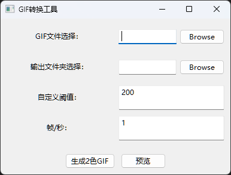
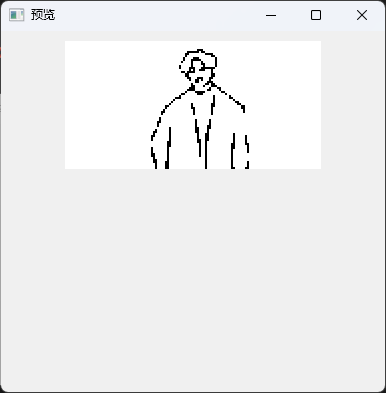

# FlipperZeroAnimator
This script converts GIFs into 2-color frames for Flipper Zero.It resizes frames to 128x64 pixels, saves as PNG files, and generates the meta file for it.  Ideal for Flipper Zero animations.

该脚本将 GIF 转换为 Flipper Zero 的 2 色帧。它将帧调整为 128x64 像素，保存为 PNG 文件，并生成相应的元文件。非常适合 Flipper Zero 动画。

# Flipper Zero GIF to 2-Color Frames Converter

This script is designed for the Flipper Zero device, allowing you to convert GIF images into a series of 2-color frames compatible with its display.

该脚本专为 Flipper Zero 设备设计，允许您将 GIF 图像转换为与其显示器兼容的一系列 2 色帧。

### 参考代码

- https://github.com/nenomg/FlipperZeroAnimator

